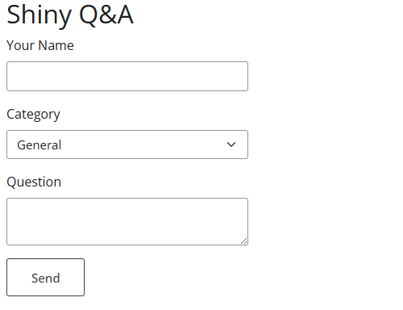

# PART 1 - Exercise 1 - Instructions

## Tasks

- Recreate the layout as shown in the image below
- You can ignore the sever function for this exercise

## Expected output

## References

- [layouts](https://shiny.posit.co/py/layouts/)
