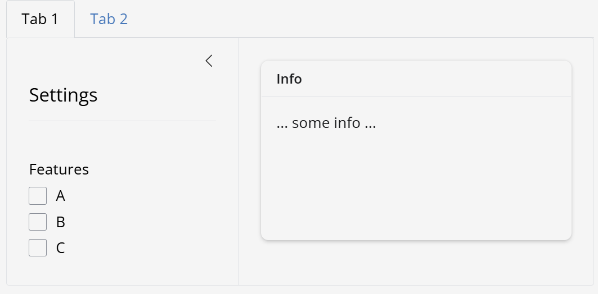

# PART 1 - Exercise 2 - Instructions

## Intro

You will create a UI with a multiple inputs and outputs, organised in 2 columns.

## Tasks

- Recreate the layout as shown in the image below
    - All inputs are in the first column (width 6)
    - The plot output placeholder is in the second column (width 6)
    - The button is not part of any column, but sits below
- You can ignore the sever function for this exercise

## Expected output

## Shinylive Link
https://pieterjanvc.github.io/RShiny2Python/shinylive/?part1_ex2

## References

- [layouts](https://shiny.posit.co/py/layouts/)
