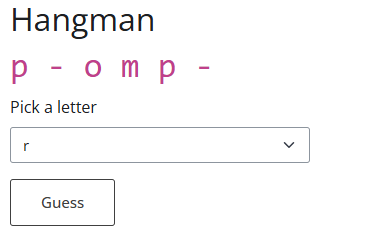

# PART 2 - Exercise 2 - Instructions

## Intro

In this app you will implement a very simple version of the
[hangman](<https://en.wikipedia.org/wiki/Hangman_(game)>) game. The data, UI and
basic game code are provided.

_You can test the game code by manually running it before making it reactive_

## Tasks

- When the user clicks the `guess` button, the game code should run using the
  letter selected in the `letter` input and the `progress` output should update
  with the result

- You will need to keep track of all guessed letters, and remove them from the  
  `letter` input after each guess

- When the user refreshes the page, the game will reset with a new random word

- To keep things simple, the result should only start appearing on the page once
  the `guess` button has been clicked. If you want an extra challenge, try to 
  make a blank result (i.e. all  `-`) appear when the game starts.

## Expected output

_This image shows the output somewhere in the middle of the game_

## Shinylive Link
https://pieterjanvc.github.io/RShiny2Python/shinylive/?part2_ex2

## References

- [reactivity](https://shiny.posit.co/py/docs/reactive-foundations.html)
