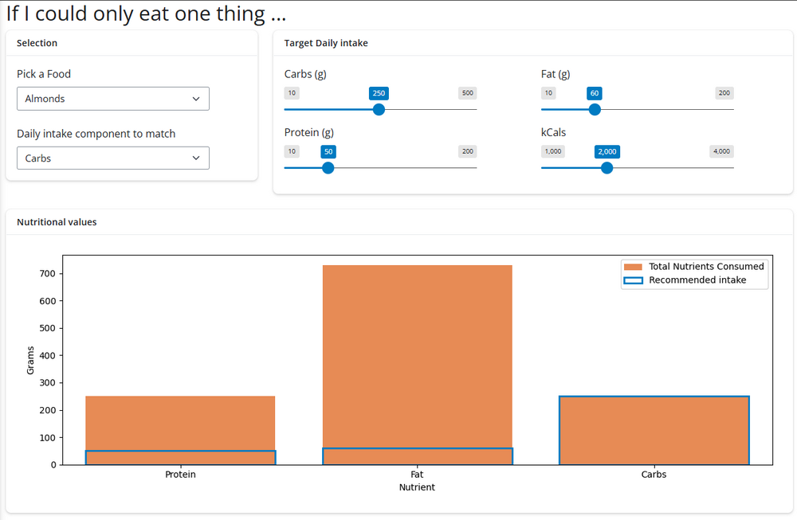

# PART 2 - Exercise 3 - Instructions

## Intro

Let explore a typical question you ask each other at social occasions:

_If you could only eat one food for the rest of your live, what would it be?_

Now let's see how healthy you would be and how this would affect your
recommended daily intake of macro nutrients.

You have been provided with an app that already has all required inputs, and
some basic, non-interactive python / seaborn code to generate a plot showing the
distribution of macro nutrients if you would only eat almonds and would target
consuming 250g of carbs in a day.

## Tasks

- Add a card to the UI with a the name "Nutritional values" containing a plot
  output to the UI underneath the provided input cards
- Create a plot function on the server and move all the code inside of it
- Link up all relevant inputs to the plot output will update as expected
- Tip: If you want to access an input based on its name you can also use
  `input["name"]()`. This allows to dynamically select an input using a variable

### Extra challenge (optional)

The dataset also contains a column with the number of grams for a set of given
nutrients. Add a title to the plot that would mention how many grams (or pounds)
you would have to eat to take in the current number of nutrients shown in the
plot.

## Expected output

## Shinylive Link

https://pieterjanvc.github.io/RShiny2Python/shinylive/?part2_ex3

## References

- [reactivity](https://shiny.posit.co/py/docs/reactive-foundations.html)
