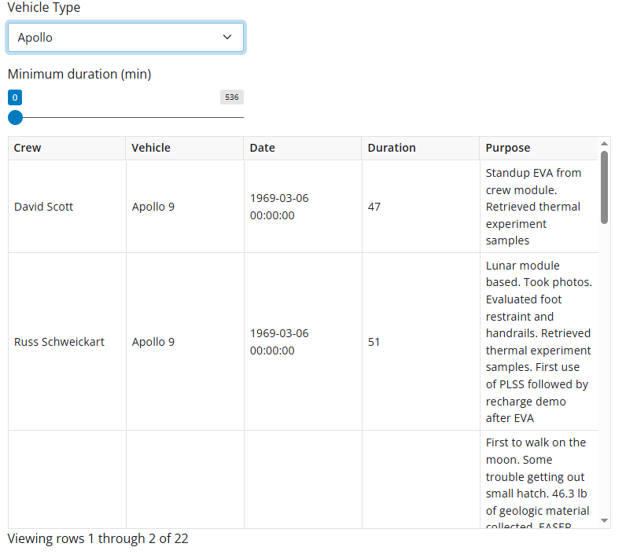

# PART 3 - Exercise 1 - Instructions

## Intro

You are exploring a dataset recording activities done by an astronaut or
cosmonaut outside a spacecraft beyond the Earth's appreciable atmosphere. You
already have written some basic python code to help you filter this dataset and
better understand the content, however, it is rather tedious to have to
constantly update specific filtering parameters and run the analysis again. You
decide to use Shiny Express to help you quickly build an interactive exploration
of the data.

## Tasks

Starting with the provided python script, add **Shiny Express syntax** to make
this script interactive.

### PART 1 - Start simple

This task should be relatively simple and result in a functional app already

- Insert a dropdown (select) element that will allow filtering on vehicle type
- Add a slider that will allow additional filtering of the dataset by minimum
  duration. Set the min and max value to the min and max found in the whole
  dataset. _(Tip, you can use the min() and max() values over a pandas dataframe
  column)_
- Convert the `subset` data frame into a reactive data frame (data_frame) and
  make sure the data is filtered based on the selected vehicle type

### PART 2 - Dynamically update the slider

This task requires additional reactive environments and logic

- Whenever the vehicle type changes, update the duration filter to only include
  the range for that type of vehicle instead of the values across the whole
  dataset
- Tip: similar to R, every `ui.input_<element>` has a corresponding
  `ui.update_<element>` function to dynamically update the inputs

## Expected output

_The output shown is for part 1. In part 2, the slider should have different min
and max values_

## Shinylive Link
https://pieterjanvc.github.io/RShiny2Python/shinylive/?part3_ex1

## References

- [dataset](https://catalog.data.gov/dataset/extra-vehicular-activity-eva-us-and-russia)
- [Shiny Express](https://shiny.posit.co/py/api/express/)
