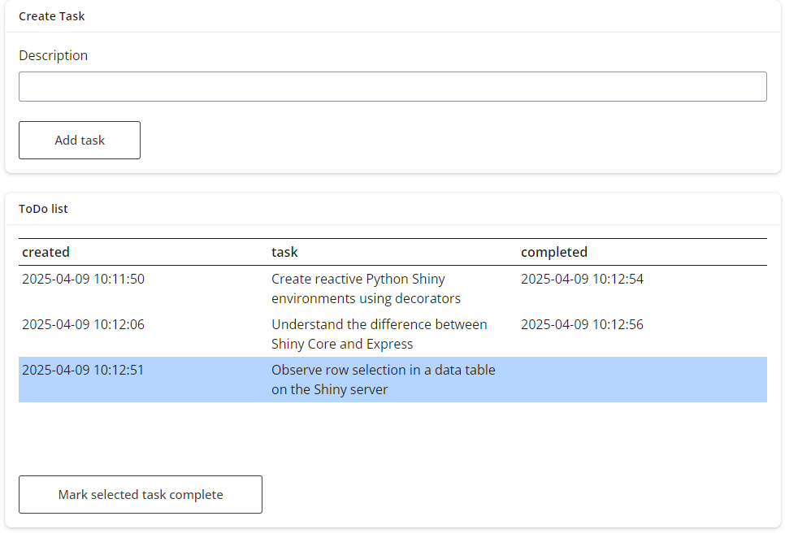

# PART 4 - Exercise 1 - Instructions

## Intro

## Tasks

## Expected output

_Note that the 3rd tab should only be there for PART 2_

## Shinylive Link
https://pieterjanvc.github.io/RShiny2Python/shinylive/?part4_ex1

## References

- [layouts](https://shiny.posit.co/py/layouts/)
- [expressify](https://shiny.posit.co/py/api/express/express.expressify.html)
