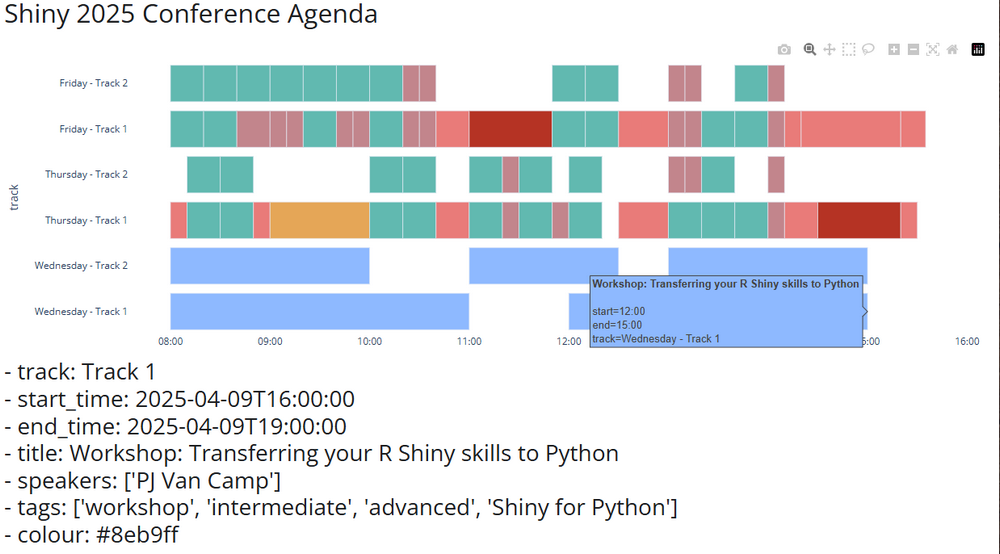

# PART 4 - Exercise 2 - Instructions

## Intro

Let's use Shiny to create an interactive agenda for this year's conference. By
displaying the agenda visually, users should be able to quickly see all the
different events ordered by track. By hovering over an event some, basic
information is shown, but clicking it will show all session details in a
separate output.

You have been given the UI and some basic code that will get the data into the
shape needed to plot the basic timeline using the plotly library. You also have
a function to generate the metadata for each event as formatted HTML.

## Tasks

- Add the plotly plot server function (i.e. _plt_)
- Add the metadata server function (i.e. _details_)
- Add an _on click_ event listener that will capture which session has been
  clicked by the user and use that information to generate the session details
  to be displayed below the plot

_Note: If you are are using **Positron**, trying to render the **plotly plot**
outside of Shiny (i.e. just in your IDE) **might not work** and result in the
editor freezing. You should however be able to see the plot appear in the Shiny
app. If please **use the shinylive link in case of issues**_

## Expected output

## Shinylive Link

https://pieterjanvc.github.io/RShiny2Python/shinylive/?part4_ex2

## References

- [Plotly in Shiny](https://shiny.posit.co/py/components/outputs/plot-plotly/)
- [Plotly Gantt Charts in Pyton](https://plotly.com/python/gantt/)
